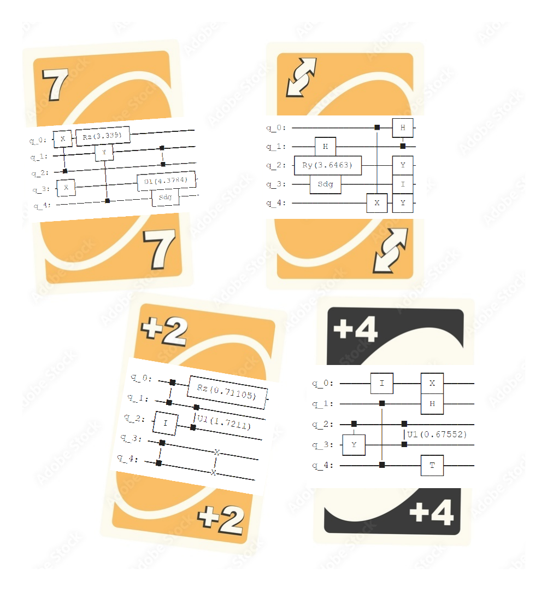
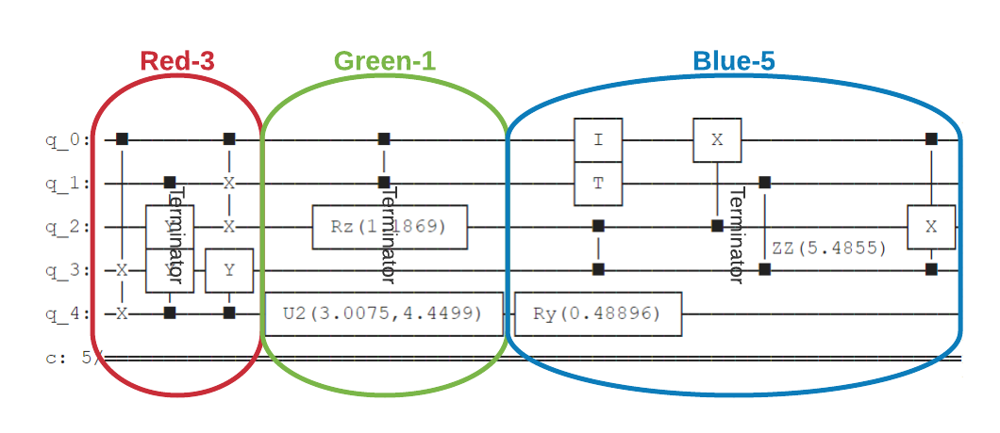

# QUnoJenga: Quantum Uno-Jenga game

Project for [MIT iQuHACK 2022](https://www.iquise.mit.edu/iQuHACK/2022-01-28): Playing Uno-Jenga on Classical vs Quantum computer powered by [IonQ](https://ionq.com/)

Team: Quantum111 *[Albert Adiyatullin](https://github.com/aadiyatul), [Anastasiia Andriievska](https://github.com/fomalhautn), [Artem Kuzmichev](https://github.com/artem-phys), [Leyla Rami](https://github.com/leylarami), [Natalia Zubova](https://github.com/natalya-zubova)*

---

*“Nature isn’t classical, damnit, so if you want to make a simulation of nature, you’d better make it quantum mechanical.”* — Physicist [Richard Feynman](https://en.wikipedia.org/wiki/Richard_Feynman)

Quantum computing has many exciting applications within all domains and has great potential to change the world to a better place. Nowadays we arestill in the NISQ era, and noise can overtake the quantum computation really fast. We suggest a game that can emphasize the role of quantum decoherence, and use it to demonstrate the difference between a quantum simulator and a real ion trap quantum computer.

A presentation of the game can be seen . A Jypyter Notebook can be seen .


# The game
You certainly know the classical Uno game. Any card you put down must either be the same color or the same number as the card in the center.


In Quantum Uno the rules are the same, but each card has a different random circuit on it. Each new card you put down, adds the new circuit to the previous one.


With every card the quantum circuit gets longer and longer. At some point it gets too long even for a quantum computer: its intrinsic noise affects the results of the calculations too much. At this *breaking point* the game stops, and the player who gave the last card loses - exactly like the one who did the last move in Jenga and crashed everything! That's why we call this game **QUnoJenga**.



### How do find the breaking point?
For this we evaluate the full quantum circuit (if you like Jenga, call it "quantum tower") on the real noisy hardware and on a classical noiseless simulator. Then we calculate an overlap between the results, and if it falls below 80%, the player fails. This is the great educational part of our game: it familiarizes the user with the concept of decoherence and  devices.

**A bit of physics.** The overlap of two wavefunctions is a good measure for coherent states, but it doesn't make much sense if the coherence is lost. Exactly like the contrast of Rabi oscillations that goes to 50% when a quantum system decoheres, something similar happens here. That's why the best value of the threshold is around 80-90% - it's enough to see the loss of coherence, but not enough to ruin your quantum state.

**A bit of IT.** We don't want to run the evaluation after each card. On the contrary, the players first construct a very long quantum circuit of e.g. 30 cards, and then it is evaluated card-by-card. This means first we compare the wavefunction overlap after the 1st card, then after the 2nd, and so on.

### Can we play without the real quantum backend?

**Totally!** 
For this, we replace the real machine with a noise simulator.
Since the IonQ simulator is ideal (it cannot emulate realistic noise yet), we introduce some quantum noise by ourselves.
In short, for this we scramble the quantum state of every qubit after each card.

We simulate realistic sources of noise for ion qubits and for atomic systems in general. 
These factors -- although very well compensated on IonQ machine -- are very commonly faced in atomic physics and serve as a great educational example. 
We allow the players to change the amount of noise on demand, thus allowing them to learn their effect and see when it starts to be important.

**More physics?** Here we go: ion qubits are sensitive to fluctiations of the environmental electric and magnetic field, which change energy of the electronic transition. 
This bring ions out of resonance with lasers that drive the quantum gates and lead to imperfect Rabi oscillations, i.e. "overshoots" or "undershoots" on the Bloch sphere.
We simulate them as small random phase rotation around all axes of the qubit, and we add them after each player's card.
This effect is dominating in comparison to e.g. the amplitude (T1) and phase (T2) decoherence time of ion qubits, and this is the reason why we concentrate on it.


# Future Direction
* Testing more shots of the game with constant evaluation of the process.
* Implementing quantum reinforced learning for improving the game model and subsequently minimizing noise of IonQ.


# Installation

Use the package manager [pip](https://pip.pypa.io/en/stable/) to install [Azura Quantum + Qiskit](https://docs.microsoft.com/en-us/azure/quantum/quickstart-microsoft-qiskit?pivots=platform-ionq), which is necessary for the connection to the IonQ backends.
For the interactive version you will also need .

```bash
pip install azure-quantum --no-warn-conflicts
pip install azure-quantum[qiskit]
pip install ipywidgets
```


## Team's personal experience at MIT iQuHACK 2022
Our team quickly found each other via gather.town. We set up a stable connection and started working on the project directly. Our team met near entre to the Dungeon Escape. Therefore after the conversation, we played trying to escape the Dungeon. We are glad to participate in such a wonderful hackathon that unites our interests and provides us with inspiration, knowledge, and future possibilities to develop. Love Quantum, Peace MIT iQuHACK 2022!


## License
[MIT](https://choosealicense.com/licenses/mit/)
